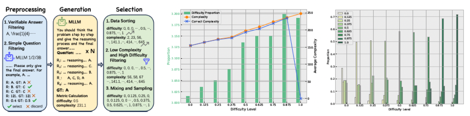
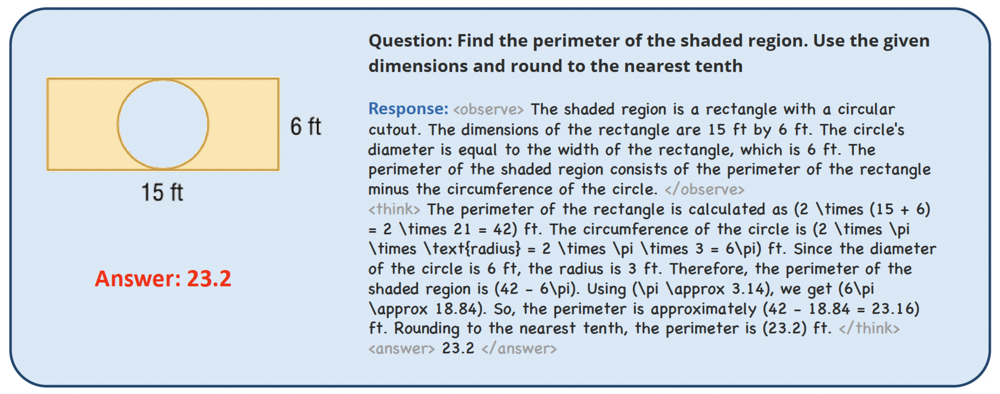
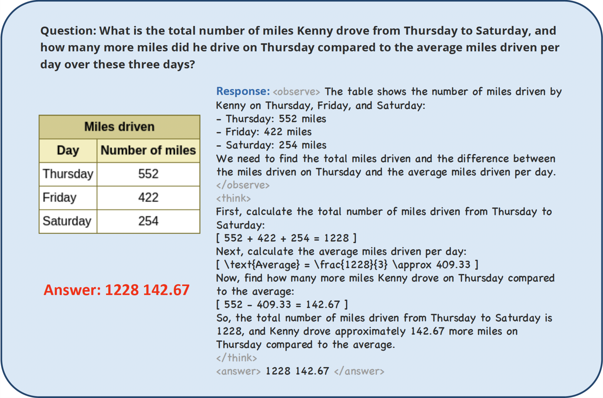

# Observe-R1: Unlocking Reasoning Abilities of MLLMs with Dynamic Progressive Reinforcement Learning


## Introduction

We present Observe-R1, a novel framework aimed at enhancing the reasoning capabilities of multimodal large language models.



**Features:**

- **Progressive Dataset:** We construct the *NeuraLadder* dataset, which is organized and sampled based on the difficulty and complexity of the questions.

- **Multimodal Format:**  We introduce `<observe> </observe>` tag which enforces the MLLM to observe the image content carefully before providing the reasoning process and the final answer.
- **Bonus Reward:** To give an additional reward to the best correct answer for better reasoning chains.
- **Dynamic Weighting and Sampling**: To focus more on optimizing those samples that offer greater benefits (greater uncertainty) during training.


### Examples from Observe-R1





### TODO List

- [x] Release the code for Observe-R1.
- [ ] Release the NeuraLadder dataset.
- [ ] Release the paper.
- [ ] Release the model checkpoint of Observe-R1.


## Quick Start

### Installation

We recommend using uv to create a Python virtual environment.

```bash
git clone https://github.com/zrguo/Observe-R1.git
cd Observe-R1
uv venv observer1 --python 3.11
source observer1/bin/activate
uv pip install -e ".[vllm]"
uv pip install flash_attn --no-build-isolation
```

> [!NOTE]
>We recommend using vLLM 0.8.3 (which is installed by default) or higher.

To install the latest vLLM:

```bash
uv pip install -e ".[vllm_latest]"
```

*(Optional)* Install flashinfer:

```bash
uv pip install flashinfer-python
```


### Prepare Datasets

Required message format:
```json
[
  {
    "message":"[
      {
        \"role\": \"user\",
        \"content\": [
            { \
                \"type\": \"image\",
                \"image\": \"file:///path/to/your/image.jpg\",
            }, \
            {\"type\": \"text\", \"text\": \"How many cats in the image?\"},
        ],
      }
    ]",
    "answer": "$3$"
  },
]
```
**Note that message is a stringfied list.**

- We can use `--input_key` to specify the `JSON key name` of the input datasets `--prompt_data {name or path}` (PPO) or `--dataset {name or path}`. **Do not** use `--apply_chat_template` for multimodal prompt, the message will be processed internally.
- OpenRLHF also support mixing multiple datasets using `--prompt_data_probs 0.1,0.4,0.5` (PPO) or `--dataset_probs 0.1,0.4,0.5`.

We will release our *NeruaLadder* dataset later.

> [!NOTE]
>
> Use `--shuffle` to keep the original order of the dataset  if you want to train sequentially.


## Training

**Train GRPO:**

```bash
bash scripts/train_grpo.sh
```

**Train Observe-R1:**

```bash
bash scripts/train_r1.sh
```

**Training on random dataset:**

```bash
bash scripts/train_random.sh
```


## Acknowledgements
Our project is based on [OpenRLHF](https://github.com/OpenRLHF/OpenRLHF) and [LMM-R1](https://github.com/TideDra/lmm-r1). Thank you for their excellent works.


